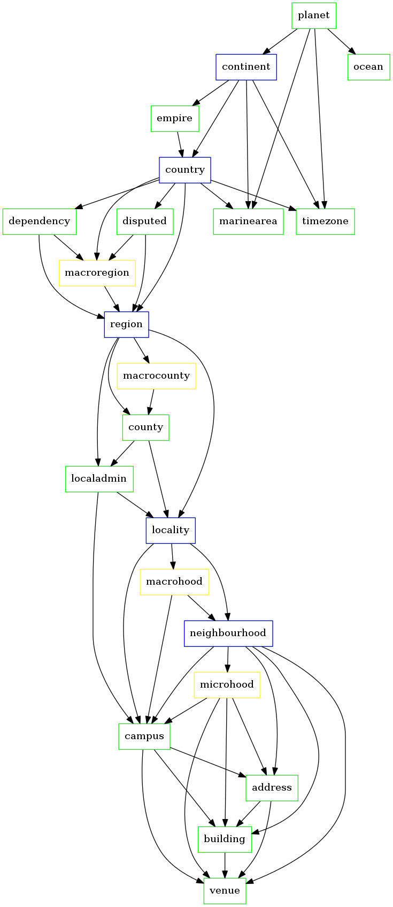

# whosonfirst-placetypes

Where things are (and what they mean) in Who's On First

## Roles

For any hierarchy of place types we have identified three “roles” that any one of those place types can fall into. That doesn't mean there can't be others (roles or place types) only that these are the ones we've identified as a good place to start.

#### Common (C)

These are, well, common across _any_ hierarchy for any place in Who's On First.

This part is important: It means that at some point every single record shares at least one or more common ancestors (for example a country or a continent or occasionally just the Earth). That doesn't preclude very specific additions to the hierarchy for a given location only that those additions need to fit within a common hierarchy shared across all locations.

#### Common_optional (CO) 

These are meant to be part of a common hierarchy but may not be present because they aren't relevant or because we don't have the data. Counties are a good example of this.

#### Optional (O)

These are the parts of a hierarchy specific, typically, to a country or region. For example, the many nested "departments" in France or Germany. The only rule is that an optional (O) place type has to fit somewhere inside the common (C) hierarchy.

So the minimum list of place types for a hierarchy applied globally looks like this:


```
- continent (C)
  - country (C)
    - region (C)
       - county (CO)
          - locality (C)
            - neighbourhood (C)
```

A more nuanced version might look like this:

``` 
- continent (C)
  - empire (CO)
    - country (C)
     - macroregion (O)
      - region (C)
       - macrocounty (O)
        - county (CO)
         - metro area (CO)
          - locality (C)
           - macrohood (O)
            - neighbourhood (C)
             - microhood (O)
              - campus  (CO)
               - building (CO)
                - address (CO)
                 - venue (C)
```

## Here is a pretty picture 

The blue boxes are `common` placetypes, the green ones `common_optional` and the yellow ones are `optional`.



_This image was generated using the [handy wof-graph-placetypes script in the py-mapzen-whosonfirst-placetypes library](https://github.com/whosonfirst/py-mapzen-whosonfirst-placetypes/blob/master/scripts/wof-graph-placetypes)_

## Placetypes

All place types have a unique 64-bit numeric ID. It should always be possible to query or filter for places by that numeric ID so that the burden of remembering whether it is `neighbourhood` or `neighborhood` or `quartier` or whatever is reserved for friendly banter over drinks.

In alphabetical order the current list of placetypes in Who's On First is:

### address

`102312329`

This is an open question. The question being: How/what do we do with OpenAddresses? We aren't sure of anything, yet, except maybe to put this here as a placeholder for probably between buildings and venues

Addresses are considered `common_optional`.

### arcade

`1159162575`

Arcades are considered `optional`.

### borough

`421205763`

A local government unit, below the `locality` placetype. Think [Brooklyn](https://spelunker.whosonfirst.org/id/421205765/).

Boroughs are considered `common_optional`.

### building

`102312327`

See also: [Imagining the Built Works Registry](https://builtworksregistry.wordpress.com/imagining-the-built-works-registry-by-aaron-straup-cope-christine-kuan/)

Buildings are considered `common_optional`.

### campus

`102312331`

Things like universities or office complexes and [airports](https://spelunker.whosonfirst.org/placetypes/campus/). Something something something, Burning Man and other annual events.

Campuses are considered `common_optional`.

### concourse

`1159162573`

Concourses are considered `optional`.

### constituency

`1108746739`

Constituencies are considered `common_optional`.

### continent

`102312309`

I think we're all in pretty broad agreement about continents, yeah?

Continents are considered `common`.

### country

`102312307`

Basically places that issue passports, notwithstanding the details (like empires which actually issue the passports...)

Continents are considered `common`.

### county

`102312313`

This needs a better - that is more abstract - name. Like "region" instead of state, province, whatever... but for counties.

Counties are considered `common_optional`.

### dependency

`102312313`

It's not a sub-region of a country but rather dependent on a parent country for defence, passport control, subsidies, etc.

Dependencies are considered `common_optional`.

### disputed

`102322043`

Places that one or more parties claim as their own. As of this writing _all_ disputed places are parented only by the country (and higher) IDs of the claimants. This isn't to say there aren't more granular hierarchies to be applied to these place only that we are starting with the simple stuff first.

Disputed areas are considered `common_optional`.

### empire

`102312335`

Or "sovereignty" but really... empire. For example the Meta United States that contains both the US and Puerto Rico.

Empires are considered `common_optional`.

### enclosure

`1159268867`

Enclosures are considered `optional`.

### installation

`1159268869`

Installations are considered `optional`.

### intersection

`1108906905`

Intersections are considered `optional`.

### localadmin

`404221409`

In many countries, the lowest level of government. They contain one or more localities (or "populated places") which themselves have no authority. Often but not exclusively found in Europe. 

Localadmins are considered `common_optional`.

### locality

`102312317`

Towns and cities, independent of size or population. Things with neighbourhoods, basically.

Localities are considered `common`.

### macrocounty

`404221413`

Bundles of counties! These exists mostly in Europe.

Macrocounties are considered `optional`.

### macrohood

`102312323`

Like "BoCoCa" which in WOE is a neighbourhood that parents another... neighbourhood.

Macrohoods are considered `optional`.

### macroregion

`404221411`

Bundles of regions! These exists mostly in Europe.

Macroregions are considered `optional`.

### marinearea

`404528655`

Places with fish and boats.

Marine areas are considered `common_optional`.

### metroarea

`102371933`

Things like "The Bay Area" – this one is hard so we shouldn't spend too much time worrying about the details yet but instead treat as something we want to do eventually.

Metropolitain areas are considered `common_optional`.

### microhood

`102312321`

Because all place is disputed. And everyone has a name for a place that will offend someone else.

Microhoods are considered `optional`.

### neighbourhood

`102312319`

Things no one will agree on. Ever.

Neighbourhoods are considered `common`.

### ocean

`404528653`

The really big marine areas. The ones that you sometimes feel cast adrift on...

Oceans are considered `common_optional`.

### planet

`102312341`

The big round thing you're standing on.

The planet is considered `common_optional`.

### postalcode

`470996387`

Postalcodes are considered `common_optional`.

### region

`102312311`

States, provinces, regions. We call them `regions`. These are places that would have a bone in a "[states rights](https://en.wikipedia.org/wiki/States'_rights)" argument. 

Regions are considered `common`.

### timezone

`136057795`

Timezones are considered `common_optional`.

### venue

`102312325`

Things with walls, often but mostly things that people stand around _together_. Things with walls  might be public (a bar) or private (your apartment) by default. 

Venues are considered `common_optional`.

### wing

`1159162571`

Wings are considered `optional`.

## ISO Country codes

Per the ISO 3166 spec which states:

```
User-assigned code elements are codes at the disposal of users who need to add further names of countries, territories, or other geographical entities to their in-house application of ISO 3166-1, and the ISO 3166/MA will never use these codes in the updating process of the standard. The following codes can be user-assigned:[19]

    Alpha-2: AA, QM to QZ, XA to XZ, and ZZ
    Alpha-3: AAA to AAZ, QMA to QZZ, XAA to XZZ, and ZZA to ZZZ
    Numeric: 900 to 999
```

We use the following ISO country codes:

### XK

We just followed [Geonames' lead](https://geonames.wordpress.com/2010/03/08/xk-country-code-for-kosovo/) and have assigned `XK` to be the ISO country code for Kosovo.

### XN

For [Null Island](http://www.nullisland.com/).

### XS

We use `XS` to indicate Somaliland.

### XX

`XX` denotes a place disputed by two or more (ISO) countries.

### XY

`XY` denotes an ISO country that has yet to be determined (by us). You might typically see this is a record for a freshly created place that hasn't been fully vetted or editorialized yet.

### XZ

`XZ` is the ISO country code equivalent of `wof:parent_id=-2` or `:shrug: the world is a complicated place`.

## Hierarchies

A Who's On First (`wof:`) hierarchy is a list of dictionaries, which each item is a dictionary containing a full hierarchy. Like this:

```
"wof:hierarchy": [
	{ "neighbourhood_id": 9997, "locality_id": 9997, "metro_id": 9998, "county_id": 9998, "region_id": 9998, "country_id": 9998, "continent_id": 9998 },
	{ "neighbourhood_id": 9997, "locality_id: 9997, "metro_id": 9999, "county_id": 9999, "region_id": 9999, "country_id": 9999, "continent_id": 9999 }
]
```

See below for details and rationale.

### How did we get here?

_The following is a verbatim written exercise to work through the issue of how a hierarchy should be represented or, more specifically, how the potentially multiple hierarchies that a given place might encompass should be represented._

Something something something as elements on the root `properties` dictionary. Like this:

```
{
	"wof:neighbourhood_id": 9999,
	"wof:locality_id": 9999,
	"wof:county_id": 9999,
	"wof:region_id": 9999,
	"wof:country_id": 9999,
	"wof:continent_id": 9999
}
```

Something something something as a dictionary on the root `properties` dictionary. Like this:
 
```
"wof:hierarchy": {
	"neighbourhood_id": 9999,
	"locality_id": 9999,
	"county_id": 9999,
	"region_id": 9999,
	"country_id": 9999,
	"continent_id": 9999
}
```

This has the advantage of keeping all the hierarchy information in one place however it is left as an exercise to the user to enforce the actual order of the hierarchy since there is no way to be certain that `programming langage X` will ensure the ordering of the dictionary keys. We could define the hierarchy as a list of dictionaries which would allow to explicitly encode the parent for that node but those extra bytes in each record will add up fast when dealing with a global hierarchy. Like this:

```
"wof:hierarchy": [
	{ "neighbourhood_id": 9999, "parent": "locality_id" },
	{ "locality_id": 9999, "parent: "county_id" },
	{ "county_id": 9999, "parent": "region_id" },
	{ "region_id": 9999, "parent": "country_id" },
	{ "country_id": 9999, "parent": "continent_id" },
	{ "continent_id": 9999, "parent": "" }
}
```

Meanwhile we also know that we want to support certain place types that will have multiple parents (because geography) like metropolitain areas or, if we choose to include them in the gazetteer proper, road networks.

At a minimum this means that some of the values for placetypes have to be lists which probably means _all_ of the values should be lists so that people don't have to think about context or test data types. For example:

```
"wof:hierarchy": {
	"neighbourhood_id": [ 9999 ],
	"locality_id": [ 9999 ],
	"metropolitain_area": [ 9999 ],
	"county_id": [ 9999, 9999 ],
	"region_id": [ 9999 ],
	"country_id": [ 9999 ],
	"continent_id": [ 9999 ],
}
```

However, it is possible to imagine a place type with not only multiple parents but multiple ancestors. A timezone or, again, a road network. In which case you find yourself with a dictionary whose values are lists of dictionaries. At which point you risk spiralling off in to Semantic Web graph theory quicksand.

So maybe the thing to do is suffer mixed content (unique IDs and lists) where the rule is the immediate (outer) hierarchy stops the moment there are multiple parents. Like this:

```
"wof:hierarchy": {
	"neighbourhood_id": 9999,
	"locality_id": 9999,
	"metro_id": [
		{ "metro_id": 9998, "county_id": 9998, "region_id": 9998, "country_id": 9998, "continent_id": 9998 },
		{ "metro_id": 9999, "county_id": 9999, "region_id": 9999, "country_id": 9999, "continent_id": 9999 }
	]
}
```

Or maybe the hierarchy is always just a list of dictionaries, each containing a full hierarchy. Like this:

```
"wof:hierarchy": [
	{ "neighbourhood_id": 9997, "locality_id": 9997, "metro_id": 9998, "county_id": 9998, "region_id": 9998, "country_id": 9998, "continent_id": 9998 },
	{ "neighbourhood_id": 9997, "locality_id: 9997, "metro_id": 9999, "county_id": 9999, "region_id": 9999, "country_id": 9999, "continent_id": 9999 }
]
```

Reasons why this last suggestion is good:

* It is explicit
* It is easy to compare multiple hierarchies
* It doesn't require the user do a lot of mental arithmetic to construct the complete hierarchy or to support whatever "efficiencies" we dream up in the moment
* It is easier to change going forward (say before an "official" launch) than the alternatives

Reasons why this last suggestion is, or might be, bad:

* If we support metropolitain areas then many places (localities, neighbourhood, venues) may have multiple hierarchies where the only difference will (likely) be the county, leaving all the remaining ancestors in common
* File size, disk space and bandwidth - this is the corollary of the first point and akin to whitespace or coordinates with > 6 decimal points in GeoJSON files

In the end the "good" reasons outweighed the "bad" reasons.

## See also

* https://github.com/whosonfirst/py-mapzen-whosonfirst-placetypes
